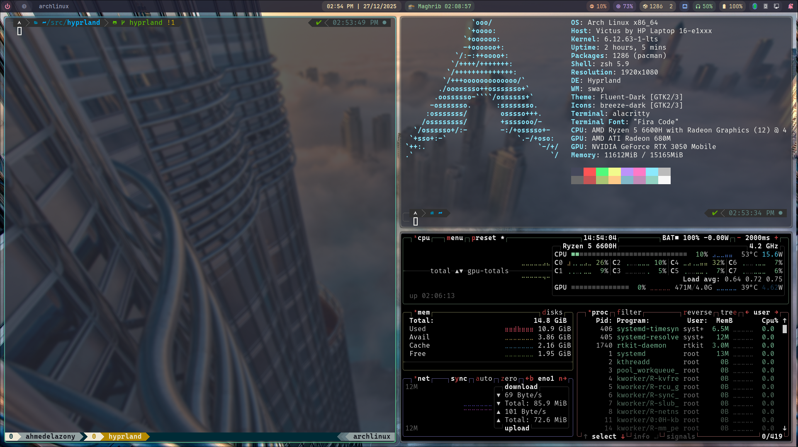

# dotfiles
My Arch Linux desktop environment dotfiles.



### Features
- Spotlight Wallpapers (windows 11 feature)
> **Note: It Works with a systemd service and timer. every 30 minutes the wallpaper changes.**


### Installation
> **Note: You should NOT run the script with root user.**

1. create `src` directory in your home directory
```bash
mkdir -p src && cd ~/src
```

2. clone the repo
```bash
git clone https://github.com/AhmedElazony/dotfiles.git
```

3. make the `install.sh` script executable
```bash
cd dotfiles

sudo chmod +x install.sh
```

4. run the script
```bash
./install.sh
```

5. Enjoy the system.

### Post-Installation

1. **Reboot** your system
   ```bash
   sudo reboot
   ```

2. At the **SDDM login screen**, select **Hyprland** as your session

3. **Configure your monitors** in `~/.config/hypr/hyprland.conf`

4. **Set your location** for prayer times in `~/.config/IslamicPrayerTimings/config`

## ⌨️ Keybindings

| Keybinding | Action |
|------------|--------|
| `Super + Return` | Open terminal (Alacritty) |
| `Super + Q` | Close active window |
| `Alt + Space` | Open app launcher (Rofi) |
| `Super + E` | Open file manager (Dolphin) |
| `Super + V` | Toggle clipboard|
| `Super + 1-9` | Switch to workspace |
| `Super + Shift + 1-9` | Move window to workspace |
